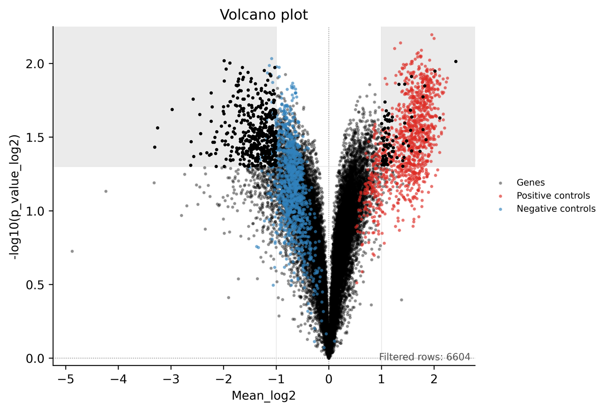

# PrPC CRISPRa Screen Pipeline

End-to-end Python workflow for processing, quality control, statistical analysis, and visualization of arrayed and pooled CRISPR screens for PrPC modulators.



*Preview of the candidate landscape output (interactive version is generated at `results/figures/candidate_volcano_interactive.html`).*

## Why This Project Exists

Large screening projects often fail at the same points:
- analysis logic is spread across ad-hoc notebooks and manual spreadsheet edits,
- figure generation is hard to reproduce,
- handoffs between biology and data teams are fragile,
- adapting a pipeline to the next campaign takes too much custom work.

This repository addresses those issues with a scriptable, staged, and reproducible analysis system. It is designed to be:
- deterministic from input files to output artifacts,
- auditable by command and commit history,
- extensible for new assays, targets, and plate designs.

## What The Pipeline Produces

Given raw assay exports and a layout/annotation table, the pipeline yields:
- integrated per-well dataset (`results/01_integrated.csv`),
- analyzed dataset with normalized metrics and statistics (`results/02_analyzed.csv`),
- hit list (`results/03_hits.csv`),
- figure set for QC and interpretation (`results/figures/*.png` and interactive `.html` outputs).

For pooled mode, the same endpoint files are produced under a dedicated output folder (for example `results_pooled/`) and are shaped to feed the same reusable plotting scripts.

Typical figures include:
- plate quality summary,
- plate-well signal series,
- replicate concordance scatter,
- signal distributions,
- volcano and ranked flashlight views,
- per-plate heatmap and grouped violin/box plot,
- Skyline-style genomic localization summary.

## Repository Layout

- `orchestrate_screen_workflow.ps1`: one-command orchestrator for the full workflow (CLI or GUI mode).
- `prpcscreen/analysis/`: normalization, score/statistic calculations, hit extraction.
- `prpcscreen/visualization/`: plotting modules used by figure scripts.
- `prpcscreen/misc/`: utility transforms (for example, 384-well to 96-well mapping).
- `prpcscreen/scripts/`: stage-level CLI entry points.
- `prpcscreen/scripts/compute_pooled_metrics.py`: pooled replicate analysis that outputs figure-compatible columns.
- `prpcscreen/scripts/run_pooled_pipeline.py`: pooled end-to-end runner that reuses existing figure scripts.
- `prpcscreen/scripts/plot_genomic_signal_skyline.py`: genomic localization / Skyline plot script.
- `docs/PIPELINE_DOCUMENTATION.md`: detailed stage behavior and manuscript mapping.
- `docs/METHODS.md`: plain-language methods section (inputs, math/stats processing, and plot interpretation).

## Quick Setup (All Versions)

Install dependencies once:

```bash
python -m pip install -r requirements.txt
```

## Pooled Screen Mode (Reuses Figure Stack)

Use this mode when your input is guide-level pooled counts (for example `Negative_R*` vs `Positive_R*` replicate columns) and you want to reuse the existing replicate/distribution/volcano figure logic without forking plotting code.

End-to-end command:

```bash
python prpcscreen/scripts/run_pooled_pipeline.py <pooled_table.xlsx> --output-dir results_pooled
```

Common options:
- explicit replicate columns: `--reference-cols Negative_R1 Negative_R2 --treatment-cols Positive_R1 Positive_R2`
- auto-detection rules: `--reference-regex`, `--treatment-regex`
- hit thresholds: `--p-cutoff 0.05 --log2fc-cutoff 0.3`
- p-value model: `--pvalue-method welch|student|paired`
- optional skyline and sublibrary support: `--genomics-excel <genomics.xlsx> --skyline-sheet skylineplot2`

The pooled runner writes:
- `results_pooled/01_integrated.csv`
- `results_pooled/02_analyzed.csv`
- `results_pooled/03_hits.csv`
- `results_pooled/figures/*` (replicate diagnostics, distribution, volcano, flashlight, optional trajectory/skyline)

## Three Versions: Which One To Use?

This project supports three run modes:

1. `cli` (PowerShell orchestrator)
2. `windows` (interactive Windows GUI)
3. `local server` (cross-platform browser UI with FastAPI)

Choose based on your use case:

- Use `cli` when you want reproducible command history, automation, and scripting/CI-friendly runs.
- Use `windows` when you are on Windows and want a point-and-click desktop workflow with file pickers and figure preview.
- Use `local server` when you want a cross-platform UI in browser (macOS/Linux/Windows), live logs, and easy operator handoff.

## Version 1: CLI

Use case:
- batch runs,
- scripted/reproducible execution,
- easy copy/paste into run logs.

Steps:
1. Open PowerShell in repo root.
2. Run the orchestrator with required arguments.

```powershell
.\orchestrate_screen_workflow.ps1 `
  -RawDir data/raw_prp `
  -LayoutCsv data/layout/layout_384.csv `
  -GenomicsExcel data/genomics/PrP_genes_and_NT_ordered_with_chromosome.xlsx
```

Options:
- required: `-RawDir`, `-LayoutCsv`, `-GenomicsExcel`
- optional: `-OutputDir` (default `results`)
- optional: `-SkylineSheet` (default `skylineplot2`)
- optional: `-SkipFret` (default `38`)
- optional: `-SkipGlo` (default `9`)
- optional: `-HeatmapPlate` (default `1`)
- optional: `-DebugMode`

## Version 2: Windows GUI

Use case:
- Windows users who prefer interactive runs,
- easier path selection and validation,
- quick figure browsing after run.

Steps:
1. Open PowerShell in repo root.
2. Start the GUI.
3. Fill/select required fields, then click `Run Pipeline`.

```powershell
.\orchestrate_screen_workflow.ps1 -Gui
```

Options:
- launch flags: `-Gui`, optional `-NoAutoScan`, optional `-DebugMode`
- required in GUI: `Raw dir/file`, `Layout CSV`, `Genomics XLSX`, `Output dir`
- optional in GUI: `Sheet`, `Skip FRET`, `Skip GLO`, `Heatmap plate`
- `Heatmap plate` supports: `1`, `1-4`, `1,2,6`, or `all`
- convenience: `Auto-fill Paths` auto-discovers candidate files

Tip: running `.\orchestrate_screen_workflow.ps1` with no CLI args opens GUI mode automatically.

## Version 3: Local Server

Use case:
- cross-platform browser interface,
- lightweight local "app" without Windows Forms dependency,
- useful for shared operator workflows.

Steps:
1. Start the local server:

```bash
python -m uvicorn webapp.app:app
```

2. Open:

```text
http://127.0.0.1:8000
```

3. In the web form: set required fields and click `Run Pipeline`.

Options:
- server launch options (uvicorn): `--host`, `--port`
- use `--reload` only for UI/code development (it can restart the server mid-run and break live run tracking)
- form fields (same workflow options): `Data root`, `Raw dir/file`, `Layout CSV`, `Genomics XLSX`, `Output dir`, `Sheet`, `Skip FRET`, `Skip GLO`, `Heatmap plate`
- `Heatmap plate` supports: `1`, `1-4`, `1,2,6`, or `all`
- convenience: `Auto-fill Paths` for auto-discovery, live log panel, figure list/preview

Phase 1 shared-workspace metadata (hosted prep):
- SQLite metadata DB path: `webapp/state/metadata.sqlite3` (runtime state, git-ignored)
- summary endpoint: `GET /api/meta/summary`
- users endpoint: `GET /api/meta/users`
- recent runs endpoint: `GET /api/meta/runs?limit=100`
- run detail endpoint: `GET /api/meta/runs/{run_id}`

## Stage-by-Stage (Advanced)

Run stage-by-stage when you need fine-grained control:

```bash
python prpcscreen/scripts/merge_assay_exports.py <raw_dir> <layout_csv> results/01_integrated.csv
python prpcscreen/scripts/compute_screen_metrics.py results/01_integrated.csv results/02_analyzed.csv --hits_csv results/03_hits.csv
python prpcscreen/scripts/plot_plate_health.py results/02_analyzed.csv results/figures/plate_qc_ssmd_controls.png
python prpcscreen/scripts/plot_genomic_signal_skyline.py <genomics.xlsx> results/figures/genomic_skyline_meanlog2fc.png --sheet skylineplot2
```

Pooled equivalent (single command, same downstream figure scripts):

```bash
python prpcscreen/scripts/run_pooled_pipeline.py <pooled_table.xlsx> --output-dir results_pooled
```

## Step-by-Step Component Guide

Use this when you want full control and visibility of each stage.

### Step 0: Optional Layout Conversion Utility

Component:
- `prpcscreen/scripts/remap_plate_coordinates.py`

Use it for:
- converting `Well_number_384` to `Well_number_96` mapping.

Command:

```bash
python prpcscreen/scripts/remap_plate_coordinates.py data/layout/layout_384.csv results/layout_96.csv
```

What you get:
- `results/layout_96.csv` with additional `Well_number_96` column.
- useful when downstream systems expect 96-well style indexing.

### Step 1: Integrate Raw Plate Exports

Component:
- `prpcscreen/scripts/merge_assay_exports.py`

Use it for:
- reading raw TR-FRET/GLO files,
- aligning measurements with plate layout metadata,
- creating a single per-well integrated table.

Command:

```bash
python prpcscreen/scripts/merge_assay_exports.py data/raw_prp data/layout/layout_384.csv results/01_integrated.csv
```

What you get:
- `results/01_integrated.csv` with aligned raw replicate and viability readouts.
- this is your canonical input for all downstream scoring and plotting.

### Step 2: Normalize, Score, and Call Hits

Component:
- `prpcscreen/scripts/compute_screen_metrics.py`

Use it for:
- per-plate normalization,
- effect-size/statistical calculations,
- optional hit list extraction.

Command:

```bash
python prpcscreen/scripts/compute_screen_metrics.py results/01_integrated.csv results/02_analyzed.csv --hits_csv results/03_hits.csv
```

What you get:
- `results/02_analyzed.csv` with derived columns such as log2 fold changes, p-values, SSMD.
- `results/03_hits.csv` with prioritized perturbations according to current thresholds.
- this is the primary table for decision-making and figure generation.

### Step 3: Plate-Level QC Figure

Component:
- `prpcscreen/scripts/plot_plate_health.py`

Use it for:
- checking positive-control vs Non-targeting-control separation by plate.

Command:

```bash
python prpcscreen/scripts/plot_plate_health.py results/02_analyzed.csv results/figures/plate_qc_ssmd_controls.png
```

What you get:
- `results/figures/plate_qc_ssmd_controls.png`.
- quick assessment of plate quality and control behavior.

### Step 4: Plate-Well Series Figure

Component:
- `prpcscreen/scripts/plot_well_trajectories.py`

Use it for:
- visualizing trends across plate/well order and spotting positional artifacts.

Command:

```bash
python prpcscreen/scripts/plot_well_trajectories.py results/02_analyzed.csv results/figures/plate_well_series_raw_rep1.png --column Raw_rep1
```

What you get:
- `results/figures/plate_well_series_raw_rep1.png`.
- visibility into edge effects, gradients, or drift patterns.

### Step 5: Replicate Concordance Figure

Component:
- `prpcscreen/scripts/plot_replicate_agreement.py`

Use it for:
- checking agreement between replicate 1 and replicate 2.

Command:

```bash
python prpcscreen/scripts/plot_replicate_agreement.py results/02_analyzed.csv results/figures/replicate_agreement_log2fc.png --stem Log2FC
```

What you get:
- `results/figures/replicate_agreement_log2fc.png`.
- confidence signal for technical consistency and data reliability.

### Step 6: Distribution Histograms

Component:
- `prpcscreen/scripts/plot_signal_distributions.py`

Use it for:
- inspecting metric distributions and global shift/spread behavior.

Command:

```bash
python prpcscreen/scripts/plot_signal_distributions.py results/02_analyzed.csv --output_html results/figures/distribution_log2fc_rep1_interactive.html --column Log2FC_rep1
```

What you get:
- `results/figures/distribution_log2fc_rep1_interactive.html`.
- fast check for skew, clipping, or unusual distribution shape, with a `Publication-quality figure` PNG export control (low/medium/high).

### Step 7: Volcano and Flashlight Ranking

Component:
- `prpcscreen/scripts/plot_candidate_landscape.py`

Use it for:
- ranking perturbations by magnitude and significance.

Command:

```bash
python prpcscreen/scripts/plot_candidate_landscape.py results/02_analyzed.csv results/figures/candidate_flashlight_ranked_meanlog2.png --volcano_html results/figures/candidate_volcano_interactive.html --genomics_excel data/genomics/PrP_genes_and_NT_ordered_with_chromosome.xlsx
```

If `--genomics_excel` is omitted or lacks a `Sublibrary` column, the volcano filter falls back to `prpcscreen/misc/supplementary_sublibrary_map.csv` (copy extracted from supplementary workbook `41551_2024_1278_MOESM4_ESM.xlsx`).

What you get:
- `results/figures/candidate_volcano_interactive.html`
- `results/figures/candidate_flashlight_ranked_meanlog2.png`
- a compact view of strongest candidate modulators and significance profile, plus export-to-SVG directly from the interactive volcano.

### Step 8: Heatmap and Violin/Box Views

Component:
- `prpcscreen/scripts/plot_spatial_and_group_views.py`

Use it for:
- per-plate spatial visualization plus global grouped comparison.

Command:

```bash
python prpcscreen/scripts/plot_spatial_and_group_views.py results/02_analyzed.csv results/figures/plate_heatmap_raw_rep1.png results/figures/grouped_boxplot_raw_rep1.png --plate 1
```

What you get:
- `results/figures/plate_heatmap_raw_rep1.png`
- `results/figures/grouped_boxplot_raw_rep1.png` (combined violin/box plot)
- high-value diagnostics for plate topology effects and group-level spread.

### Step 9: Genomic Localization (Skyline)

Component:
- `prpcscreen/scripts/plot_genomic_signal_skyline.py`

Use it for:
- plotting effect signal by genomic position/chromosome.

Command:

```bash
python prpcscreen/scripts/plot_genomic_signal_skyline.py data/genomics/PrP_genes_and_NT_ordered_with_chromosome.xlsx results/figures/genomic_skyline_meanlog2fc.png --sheet skylineplot2
```

What you get:
- `results/figures/genomic_skyline_meanlog2fc.png`.
- chromosome-level context for hit distribution and cluster interpretation.

### Step 10: Full Orchestration (Recommended For Production Runs)

Component:
- `orchestrate_screen_workflow.ps1`

Use it for:
- executing all core stages in a single reproducible run.

Command:

```powershell
.\orchestrate_screen_workflow.ps1 `
  -RawDir data/raw_prp `
  -LayoutCsv data/layout/layout_384.csv `
  -GenomicsExcel data/genomics/PrP_genes_and_NT_ordered_with_chromosome.xlsx `
  -OutputDir results
```

What you get:
- all core CSV outputs and figure outputs under `results/`.
- consistent run structure suitable for handoff, audit, and manuscript support.

## IT Strategy You Can Reuse For Other Screens

This repository is not only analysis code. It is a reusable IT pattern for screening programs.

Core strategy:
1. Define stable data contracts.
2. Split the pipeline into idempotent stages.
3. Store each stage as a script with explicit inputs/outputs.
4. Standardize artifact locations and naming.
5. Automate orchestration in one launcher.
6. Keep figure generation in code, not manual post-processing.
7. Capture provenance (commit hash, commands, dependency versions).

How to adapt this strategy to another screen:
1. Copy the repository as a baseline project template.
2. Update input schema assumptions in integration and analysis scripts.
3. Replace normalization and score functions in `prpcscreen/analysis/` for the new assay biology.
4. Adjust hit criteria and thresholds in analysis stage scripts.
5. Keep the same stage boundaries and output structure so downstream tooling remains stable.
6. Update plot modules in `prpcscreen/visualization/` to match your assay readouts.
7. Update `orchestrate_screen_workflow.ps1` defaults and required arguments for your dataset locations.
8. Validate on a small pilot dataset before full-batch execution.

Recommended governance when adapting:
- pin dependencies via `requirements.txt`,
- keep one commit per logical change,
- run scripts from repo root,
- preserve backward-compatible column names when possible,
- document any schema changes in `docs/PIPELINE_DOCUMENTATION.md`.

## Adaptation Checklist For New Screening Campaigns

Before first production run on a new campaign:
1. Confirm required columns exist in layout and raw tables.
2. Confirm control annotations are complete (`Is_NT_ctrl`, `Is_pos_ctrl` or equivalent).
3. Confirm per-plate well counts and plate IDs are consistent.
4. Confirm normalization method matches assay assumptions.
5. Confirm hit threshold definitions with the biology team.
6. Confirm each expected figure is generated without missing-data warnings.
7. Freeze the run by recording commit, command, and environment snapshot.

## What Success Looks Like

A successful run gives you:
- reproducible hit calling from raw exports,
- transparent QC for plate and replicate behavior,
- consistent figure outputs for decision meetings and manuscripts,
- a maintainable codebase that can be repurposed for future screens with limited rework.

## Documentation

For full technical detail and manuscript mapping, see:
- `docs/PIPELINE_DOCUMENTATION.md`


One-time global automation for future repos:

`powershell
.\repo-maintenance-scripts\setup-global-git-template-hooks.ps1
` 

After setup, use normal commits:

```powershell
git add ...
git commit
```

The hook lives in `.githooks/prepare-commit-msg` and is repo-versioned.
