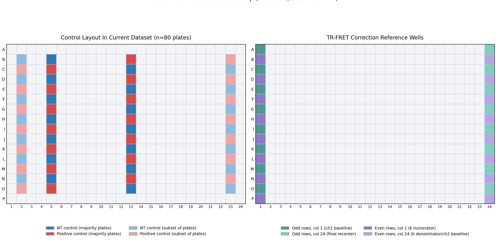

# Methods: PrPC CRISPRa Screen Pipeline

This page documents exactly what the pipeline expects as input and how those files are transformed into analysis outputs.

Core outputs:
- `results/01_integrated.csv`
- `results/02_analyzed.csv`
- `results/03_hits.csv`
- `results/figures/*`

## 1. Input File Contracts

### 1.1 TR-FRET raw export files (required)

Each TR-FRET file is expected to contain plate-formatted data after skipping header lines (`--skip-fret`, default `38`):
- first column: row labels (`A`..`P`),
- columns: `1..24` or `01..24`,
- at least 32 plate rows for two-channel correction:
  - rows 1-16: channel 1 matrix (`16 x 24`),
  - rows 17-32: channel 2 matrix (`16 x 24`).

If two complete channels are unavailable, the parser falls back to the first `16 x 24` block.

File discovery and naming:
- TR-FRET files are auto-detected by filename (`fret`, `tr-fret`, `trfret`) or plate-like structure.
- Replicates are inferred from filename suffix:
  - `...A` -> replicate 1,
  - `...B` -> replicate 2.
- Plate labels are inferred from names like `Plate_LXXIV_A.csv` or legacy patterns like `5000_<plate>_PRP_...`.

### 1.2 Layout/annotation CSV (required)

The layout CSV is the scaffold that defines biological identity for each well and plate.

Required for reliable full-pipeline behavior:

| Column | Type | Meaning |
|---|---|---|
| `Plate_number_384` | string | Plate ID (for example `LXXIV`) used for plate alignment and grouping |
| `Well_number_384` | integer (1-384) | Well index in row-major 384-well convention |
| `Is_NT_ctrl` | boolean | Non-targeting control flag |
| `Is_pos_ctrl` | boolean | Positive control flag |
| `Entrez_ID` | numeric or string | Gene annotation; non-null marks library genes |

Recommended metadata columns:

| Column | Meaning |
|---|---|
| `Plasmid_ID` | Reagent identity per well |
| `Gene_symbol` | Human-readable gene label |
| `TSS_ID`, `Is_main_TSS` | Transcript/TSS metadata |
| `Target_flag` | Optional sub-classing (for example own-Non-targeting controls) |

Important constraints:
- one row per measured well,
- no duplicate `(Plate_number_384, Well_number_384)` pairs,
- controls should not be double-labeled (`Is_NT_ctrl = True` and `Is_pos_ctrl = True` at the same row),
- boolean control columns should be explicit (`True/False`, `1/0`, or `yes/no` style values parseable by pandas).

### 1.3 GLO raw export files (optional)

GLO files are parsed similarly (`--skip-glo`, default `9`) and used to populate `CellTiterGlo_raw`, then derive GLO-adjusted metrics.

### 1.4 Genomics workbook (required only for skyline plot)

Excel file with chromosome/genomic-position annotations used by `plot_genomic_signal_skyline.py`.

## 2. Control Positions and Plate Map

Controls are not hardcoded in plotting/statistics; they are read from `Is_NT_ctrl` and `Is_pos_ctrl` in the layout table.
However, the current dataset has a recurrent physical control pattern.

In `results/01_integrated.csv` (80 plates):
- 78 plates have 28 controls each,
- 1 plate has 27 controls,
- 1 plate has 14 controls.

Primary recurring control bands are in rows `B..O`:
- column `05` and column `13`, with alternating Non-targeting and positive controls by row.

Explicit alternating pattern in the primary band:
- column `05`: `B,D,F,H,J,L,N = Non-targeting`, `C,E,G,I,K,M,O = positive`.
- column `13`: inverse of column `05` (`B,D,F,H,J,L,N = positive`, `C,E,G,I,K,M,O = Non-targeting`).

Subset-specific controls also appear in:
- column `02` (17 plates),
- column `23` (16-17 plates, slight missingness in one row on one plate).

Reference figure:



How to read the figure:
- Left panel: control map learned from layout annotations in this dataset.
- Right panel: wells used by the TR-FRET two-channel correction math.
- Legend colors indicate control class or correction-reference role.

Regeneration:
- Figure is generated by `prpcscreen/scripts/plot_plate_layout_reference.py`.

## 3. Step-by-Step: Construct an Ingestible Layout CSV

1. Start a table with one row per assayed well.
2. Add `Plate_number_384` using plate labels that match the labels inferable from raw filenames.
3. Add `Well_number_384` as integers `1..384` per plate using row-major mapping:
   - `A01 = 1`, `A24 = 24`, `B01 = 25`, ..., `P24 = 384`.
4. Fill control flags:
   - `Is_NT_ctrl = True` only for Non-targeting controls,
   - `Is_pos_ctrl = True` only for positive controls,
   - all other wells `False`.
5. Fill gene annotation (`Entrez_ID`, `Gene_symbol`, optionally `Plasmid_ID`, `TSS_ID`).
6. Save as UTF-8 CSV (comma-separated, header row included).
7. Validate before running pipeline:
   - each plate has expected well count (usually 384),
   - no duplicate plate/well keys,
   - control counts per plate are plausible and non-zero,
   - control labels are mutually consistent.

Quick validation example:

```python
import pandas as pd
df = pd.read_csv("layout_384.csv")
assert not df.duplicated(["Plate_number_384", "Well_number_384"]).any()
assert {"Is_NT_ctrl", "Is_pos_ctrl", "Entrez_ID"}.issubset(df.columns)
print(df.groupby("Plate_number_384")[["Is_NT_ctrl", "Is_pos_ctrl"]].sum().head())
```

## 4. Step-by-Step: Prepare Raw TR-FRET/GLO Exports

1. Keep raw files in one root directory (subfolders allowed).
2. Use filenames that include plate IDs and replicate suffixes (`A`/`B`) whenever possible.
3. Ensure TR-FRET exports keep both channel blocks in the same file (preferred).
4. Keep numeric plate columns named `1..24` or `01..24`.
5. Run merge step with explicit skip settings if your header line counts differ:

```powershell
python prpcscreen/scripts/merge_assay_exports.py `
  <raw_dir> <layout_csv> results/01_integrated.csv `
  --skip-fret 38 --skip-glo 9 --debug
```

6. Inspect debug logs to confirm:
   - discovered TR-FRET and GLO files,
   - mapped plate labels for replicate 1/2,
   - final vector lengths are consistent with layout rows.

## 5. Why TR-FRET Uses Two Channels

TR-FRET measures donor and acceptor emissions. One channel alone includes biological signal plus optical/background components. Two-channel correction improves specificity by removing channel-coupled background effects before normalization.

Per plate, with odd rows `A,C,E,G,I,K,M,O` and even rows `B,D,F,H,J,L,N,P`:

```text
k = (mean(ch1[even, col1]) - mean(ch1[even, col24]))
    / (mean(ch2[even, col1]) - mean(ch2[even, col24]))

ch1_f = ch1 - mean(ch1[odd, col1])
ch2_f = ch2 - mean(ch2[even, col24])

fret = ch1_f - k * ch2_f
fret = fret - mean(fret[odd, col24])
```

The corrected `fret` matrix is flattened row-major into 384 values.

## 6. Integration and Alignment

- Replicate A-like files map to `Raw_rep1`, B-like files to `Raw_rep2`.
- Plate chunks are aligned to the layout's plate order and expected per-plate row counts.
- This prevents plate/well misassignment.
- Output is written as `results/01_integrated.csv`.

## 7. Normalization and Derived Columns

Before logs, raw replicates are clipped at lower bound `1`.

Default normalization mode is `genes and all Non-targeting` (implemented with gene-population baseline per plate for R-compatible behavior):

```text
baseline = median(raw values among gene-annotated wells on the plate)

DeltaNT = raw - baseline
FoldNT  = raw / baseline
Log2FC  = log2(raw) - median(log2(raw baseline-group values))
```

Also produced:
- `PercActivation_rep*` using positive controls on the same plate,
- GLO-adjusted variants (`Raw_Glo_*`, `Log2FC_Glo_*`) when GLO exists.

## 8. Statistical Model

For each row:

```text
mean_row = (rep1 + rep2) / 2
var_row  = (rep1 - rep2)^2 / 2
s0_plate = median(var_row among Non-targeting controls on that plate)

SSMD_mod = mean_row / sqrt(0.5 * var_row + 0.5 * s0_plate)
p_value  = 2 * sf_t(|SSMD_mod|, df=1)
```

P-values are clipped to `[1e-300, 1]`.
`results/02_analyzed.csv` stores the derived metrics and statistics.

## 9. Hit Definition

```text
Mean_log2 = (Log2FC_rep1 + Log2FC_rep2) / 2
Hit if: p_value_log2 < 0.05 and abs(Mean_log2) > 1.0
```

Hits are exported to `results/03_hits.csv`.

## 10. Volcano Inclusion Rules

Volcano includes:
- gene-annotated wells (`Entrez_ID` present),
- non-targeting controls,
- positive controls.

Volcano excludes:
- unannotated non-control wells (for example empty/no-virus wells).

## 11. Generated Figures and Interpretation

- `plate_qc_ssmd_controls.png`: plate-level control separation quality.
- `plate_well_series_raw_rep1.png`: well-order trend for positional artifacts.
- `replicate_agreement_log2fc.png`: replicate concordance.
- `distribution_log2fc_rep1_interactive.html`: interactive category-toggling histogram with built-in `Publication-quality figure` PNG export.
- `candidate_volcano_interactive.html`: interactive volcano with category toggles and gene highlighting.
- `candidate_flashlight_ranked_meanlog2.png`: ranked effect profile.
- `plate_heatmap_raw_rep1.png`: spatial heatmap by selected plate.
- `grouped_boxplot_raw_rep1.png`: combined violin/box distribution summary.
- `genomic_skyline_meanlog2fc.png`: genomic-coordinate skyline of effects.

## 12. Reproducibility

- Deterministic scripted stages.
- Intermediate files persisted for audit and rerun.
- Same inputs and options produce the same outputs.
