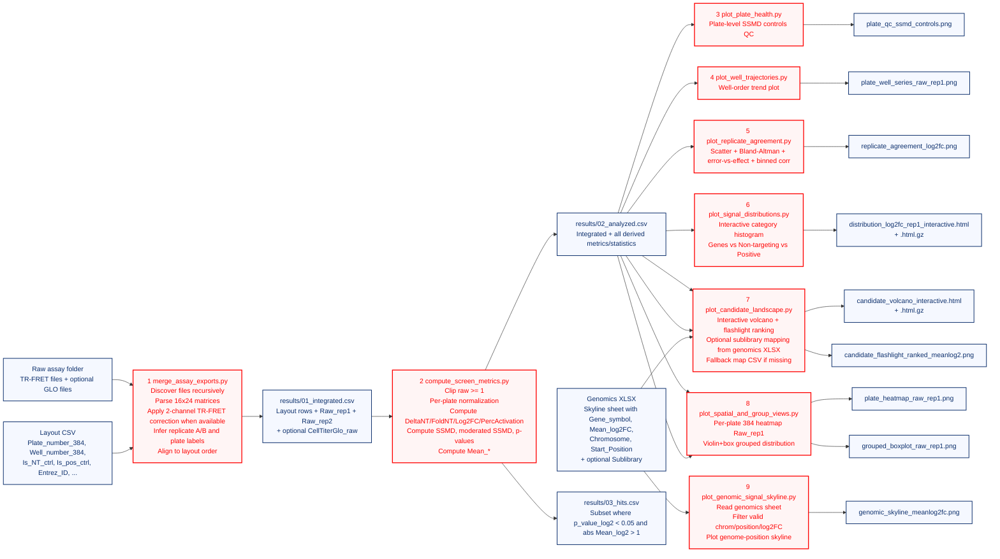
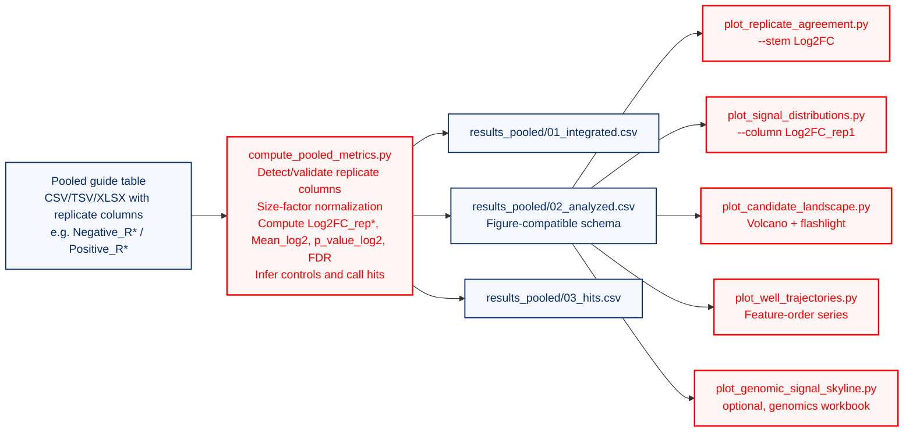

# PrPC Screen Pipeline Flowchart

This document summarizes the end-to-end data flow implemented in this repository.

Key correction to common assumptions:
- Plate/well-to-gene assignment comes from the `Layout CSV`.
- The genomics workbook (`Genomics XLSX`) is used for:
  - Skyline genomic plotting input, and
  - optional sublibrary mapping in interactive volcano output.

## High-Level Flow

## Pooled Flow (Reusing Existing Figure Logic)

For pooled screens, the upstream analysis is different, but the downstream figure stack is reused by emitting a compatible analyzed table.

## Stage Contracts

## Stage 1: Integration (`merge_assay_exports.py`)

Inputs:
- Raw assay directory/file root (`*.csv`, `*.tsv`, `*.txt`)
- Layout CSV (annotation scaffold)
- Optional GLO files

Transformations:
- Recursive discovery of measurement files.
- TR-FRET plate parsing from A..P x 1..24 tables.
- Two-channel TR-FRET correction when full channel blocks exist.
- Replicate classification from filename suffix (`A` -> rep1, `B` -> rep2).
- Plate label inference and alignment to layout plate order.
- Stale analysis columns removed from layout scaffold before attaching new signals.

Output:
- `results/01_integrated.csv`
- Contains layout metadata plus `Raw_rep1`, `Raw_rep2`, and optional `CellTiterGlo_raw`.

## Stage 2: Metrics and Hits (`compute_screen_metrics.py`)

Input:
- `results/01_integrated.csv`

Transformations:
- Numeric coercion and floor clipping for `Raw_rep1`/`Raw_rep2` to minimum 1.
- Per-plate normalization (`norm_plates`) to derive:
  - `DeltaNT_rep*`
  - `FoldNT_rep*`
  - `PercActivation_rep*`
  - `Raw_log2_rep*`
  - `Log2FC_rep*`
- GLO-adjusted variants when GLO is present:
  - `Raw_Glo_rep*`, `DeltaNT_Glo_rep*`, `FoldNT_Glo_rep*`, `Log2FC_Glo_rep*`
- Statistics per metric pair:
  - `SSMD_*`, `SSMD_mod_*`, `Mean_*`, `p_value_*`, `p_value_repro_*`
- Hit calling:
  - `p_value_log2 < 0.05` and `abs(Mean_log2) > 1.0`

Outputs:
- `results/02_analyzed.csv` (full derived table)
- `results/03_hits.csv` (hit subset of analyzed rows)

## Stages 3-9: Figures

Shared primary input:
- `results/02_analyzed.csv`

Generated outputs:
- `results/figures/plate_qc_ssmd_controls.png`
- `results/figures/plate_well_series_raw_rep1.png`
- `results/figures/replicate_agreement_log2fc.png`
- `results/figures/distribution_log2fc_rep1_interactive.html` (+ `.gz`)
- `results/figures/candidate_volcano_interactive.html` (+ `.gz`)
- `results/figures/candidate_flashlight_ranked_meanlog2.png`
- `results/figures/plate_heatmap_raw_rep1.png`
- `results/figures/grouped_boxplot_raw_rep1.png`
- `results/figures/genomic_skyline_meanlog2fc.png`

Genomics workbook usage:
- Stage 7 (`plot_candidate_landscape.py`):
  - Optional sublibrary enrichment labels for volcano filtering.
  - If `Sublibrary` is not found, fallback to `prpcscreen/misc/supplementary_sublibrary_map.csv`.
- Stage 9 (`plot_genomic_signal_skyline.py`):
  - Required source sheet containing:
    - `Gene_symbol`
    - `Mean_log2FC`
    - `Chromosome`
    - `Start_Position`
  - `--sheet` defaults to `skylineplot2`, with fallback to a matching/compatible sheet; if none is compatible, the step fails with a schema error.

## Optional Utility (not part of 9-stage core flow)

- `prpcscreen/scripts/remap_plate_coordinates.py`
  - Converts `Well_number_384` to `Well_number_96` mapping for downstream compatibility.
